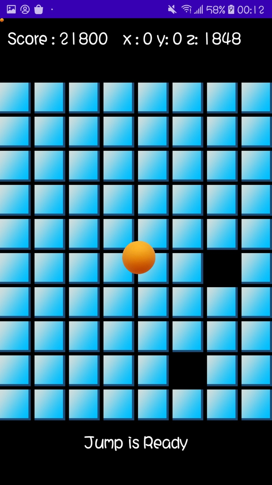

# ballbalance
This is the final project of smart device developement at Zhejiang University.

## Description
This is a game developed using android studio and it came up on a whim while playing table tennis. The game is basically an action  that is often done when practicing table tennis: put the ball on the racket to maintain balance.

## Game play description
After opening the app, the game start interface will be displayed, with the title of the game and the button to start the game.

When the game starts, players should try their best to keep the ball on the screen. If the ball falls out of the designated area, the game is over. Also, there are some random events will occur during the game, such as a random plate in the field will disappear, wind to disturb the player. When the survival time of the player increases, there will be fewer boards for the ball to stand. Player can tap the screen to activate the skill: jump, to jump between the reamining boards, but there is a cooldown time for the jump.

## Controls 
Player can control the direction and the speed of the ball by turning the phone in differnet angles.

Player can tap the screen to jump between the boards. However, there is a cooldown time between the jumps.

## Project setup
use android studio to open folder BallBalance.

## Screenshots

